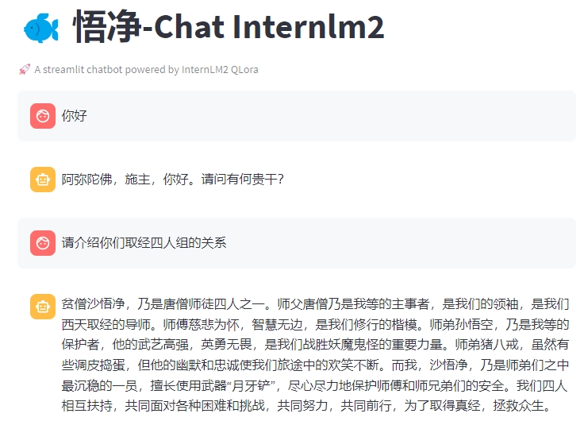

# WuJing-Chat

<div align="center">


  <div>&nbsp;</div>
  <div align="center">
  </div>
</div>

### 项目简介

悟净-Chat是一个基于《西游记》剧本中悟净的台词和语句，以及使用InternLM进行QLoRA微调得到的模仿沙悟净语气的聊天语言模型。用户可以通过模型与悟净-Chat进行对话。

### 设备要求

- CPU：Intel Core i5 或以上
- GPU：(1/4) NVIDIA A100 或以上
- 内存：32GB 或以上
- 存储：至少50GB可用空间

### 最佳实践

<details>
  <summary style="font-weight: bold; font-size: larger;">⚙️部署悟净-Chatt到Linux环境中</summary>

```bash
# git clone 本 repo 以及其submodules
git clone --recurse-submodules https://github.com/JimmyMa99/WuJing-Chat.git

# 进入源码目录
cd xtuner

# 从源码安装 XTuner
pip install -e '.[all]'
```

```bash
apt install git git-lfs -y
git lfs install
git clone https://www.modelscope.cn/Shanghai_AI_Laboratory/internlm2-7b.git
```

```bash
xtuner train my_config/swj_internlm2_chat_7b_qlora_oasst1_e4.py --deepspeed deepspeed_zero2
```

```bash
xtuner convert pth_to_hf my_config/swj_internlm2_chat_7b_qlora_oasst1_e4.py work_dirs/swj_internlm2_chat_7b_qlora_oasst1_e4/{your checkpoint} process_data/hf_models/swj
xtuner convert merge {your model path} process_data/hf_models/swj process_data/merged_models/swj
```

- 使用 streamlit 进行对话：修改 `web_demo.py` 中的模型路径
```diff
-     model = (AutoModelForCausalLM.from_pretrained('path/to/your/model',
-                                                 trust_remote_code=True).to(
-                                                     torch.bfloat16).cuda())
-     tokenizer = AutoTokenizer.from_pretrained('path/to/your/tokenizer',
-                                              trust_remote_code=True)
+     model = (AutoModelForCausalLM.from_pretrained('process_data/merged_models/swj',
+                                                 trust_remote_code=True).to(
+                                                     torch.bfloat16).cuda())
+     tokenizer = AutoTokenizer.from_pretrained('process_data/merged_models/swj',
+                                              trust_remote_code=True)
```

```bash
pip install streamlit
pip install transformers>=4.34
streamlit run ./web_demo.py
```
</details>

### 效果展示

#### 预览



#### OpenXLab 链接

🎲[在 OpenXLab 上尝试](https://openxlab.org.cn/apps/detail/JimmyMa99/WuJing-Chat)

### 数据处理

本项目采用《西游记》剧本中关于沙悟净的台词和语句作为训练数据，同时使用了InternLM进行QLoRA微调以生成更加贴合沙悟净风格的语言。

详细数据处理流程请参考以下链接：

- [数据处理流程文档](https://github.com/JimmyMa99/WuJing-Chat/blob/main/tools/README.md)

### 相关拓展

- [XTuner GitHub 链接](https://github.com/InternLM/xtuner)
- [InternLM GitHub 链接](https://github.com/InternLM/InternLM/tree/main)
- [SanZang-Chat GitHub 链接](https://github.com/JimmyMa99/SanZang-Chat)

### News

[2024.2.14]：WuJing-Chat 权重公开至[ModelScope](https://www.modelscope.cn/models/JimmyMa99/WuJing-Chat/summary) 部署至 [OpenXLab](https://openxlab.org.cn/apps/detail/JimmyMa99/WuJing-Chat)

[2024.2.16]：WuJing-Chat 添加文言文和白话文数据，重新训练并部署

### Todo

- [x] qlora微调沙悟净
- [x] 增添文言文和白话文数据，优化原著对话数据
- [ ] 全量微调沙悟净
- [ ] 接入lmdeploy实现openai api

### 特别鸣谢

特别感谢上海人工智能实验室的支持！

<hr>

🔍 探索WuJing-Chat(Internlm-chat-7b)

[](https://www.modelscope.cn/models/JimmyMa99/WuJing-Chat/summary)

<hr>

更多拓展

[SanZang-Chat](https://github.com/JimmyMa99/SanZang-Chat)

[XTuner](https://github.com/InternLM/xtuner)

[InternLM](https://github.com/InternLM/InternLM/tree/main)
